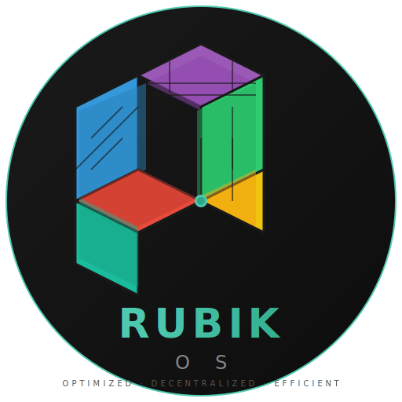

# Rubik OS

> **Optimizada para memoria. Arquitectura descentralizada. Inspirada en el Cubo Rubik.**  
> Una distribución Linux basada en Arch para equipos con pocos recursos.

[](https://www.gnu.org/licenses/gpl-3.0)
[](https://archlinux.org)
[](https://wiki.archlinux.org/title/Archiso)
[]()

<p align="center">
  
</p>

---

## Motivación

Los sistemas operativos modernos desperdician memoria. Un Linux promedio usa **300-400 MB** en idle solo con el sistema base. Rubik OS demuestra que se puede tener un sistema completo, funcional y seguro usando **80-120 MB** — sin sacrificar capacidad.

**¿Cómo?** Reorganizando cada componente como una celda independiente, como las caras de un Cubo Rubik. Cada celda tiene un propósito único, recursos limitados, y puede ser reemplazada sin afectar al resto.

---

## Las 6 Caras

```
        ┌─────┬─────┬─────┐
        │  F4 │  F4 │  F4 │
        │  UI  │  &  │  UX  │
        ├─────┼─────┼─────┤
   ┌────┼─────┼─────┼─────┼────┬─────┬─────┬─────┐
   │ F5 │ F5  │ F5  │ F3  │ F3 │ F3  │ F3  │ F3  │
   │Seg │ &   │Isla │Red  │ &  │Comu │nica │ción │
   ├────┼─────┼─────┼─────┼────┼─────┼─────┼─────┤
   │cur │idad │     │     │    │     │     │     │
   └────┴─────┴─────┴─────┴────┴─────┴─────┴─────┘
        │  F2 │  F2 │  F2 │
        │Alma │cena │miento│
        ├─────┼─────┼─────┤
        │  F1 │  F1 │  F1 │
        │Proce│sos  │& Svc│
        ├─────┼─────┼─────┤
        │  F0 │  F0 │  F0 │
        │Kernel│& Mem│oria │
        └─────┴─────┴─────┘
```

| Cara | Subsistema | Celdas | ¿Qué hace? |
|------|-----------|--------|------------|
| **F0** | Kernel & Memoria | 9 | ZRAM, earlyOOM, IRQ balance, CPU governor, predicción de memoria |
| **F1** | Procesos & Servicios | 9 | RubikD orchestrator, cgroups, scheduler tuning, init mínimo |
| **F2** | Almacenamiento | 9 | Btrfs subvolumes, tmpfs, trim, dedup, mount manager |
| **F3** | Red & Comunicación | 9 | iwd (wifi), nftables, DNS cache, chrony, bandwidth limiter |
| **F4** | Interfaz & Experiencia | 9 | River WM, waybar, foot terminal, mako notificaciones |
| **F5** | Seguridad & Aislamiento | 9 | AppArmor, bubblewrap, LUKS, cell isolation, audit |

**54 celdas atómicas. 6 caras. 1 sistema.**

---

## Eficiencia vs Linux estándar

| Métrica | Linux promedio | Rubik OS | Mejora |
|---------|---------------|----------|--------|
| 💾 RAM idle (sin GUI) | ~300-400 MB | **~80-120 MB** | 60-70% |
| 🖥 RAM idle (con GUI) | ~800-1200 MB | **~250-400 MB** | 55-65% |
| 🚀 Arranque a shell | ~15-30s | **~5-10s** | 50-65% |
| 🚀 Arranque a GUI | ~30-60s | **~10-20s** | 55-65% |
| 🔄 Procesos en idle | ~400-600 | **~80-150** | 60-75% |
| 📦 Tamaño ISO | ~2-3 GB | **~500-800 MB** | 60-75% |

## Requisitos mínimos

| Componente | Mínimo | Recomendado |
|-----------|--------|-------------|
| RAM | **256 MB** | 1 GB |
| CPU | **x86_64, 1 core** | 2+ cores |
| Almacenamiento | **4 GB** | 8 GB+ |
| GPU | fbdev compatible | KMS/drm |

---

## Quick Start

```bash
# 1. Clonar
git clone https://github.com/erac73/rubik-os.git
cd rubik-os

# 2. Construir la ISO (requiere Arch Linux o contenedor)
sudo ./scripts/build-iso.sh

# 3. La ISO está lista
ls -lh out/rubik-os-*.iso
```

### O instalar desde cero

```bash
# Bootear la ISO → ejecutar el instalador
rubik-install
```

### Gestionar el sistema

```bash
# Ver estado de todas las celdas
rubikctl status

# Health check
rubikctl health

# Reemplazar una celda en caliente
rubikctl cell rotate memory-compression

# Rotar una cara completa
rubikctl face rotate F0
```

---

## Arquitectura

Cada celda es un proceso/servicio independiente con:

```
📦 Celda
├── Propio cgroup (memoria, CPU, IO aislados)
├── Propio perfil AppArmor
├── Límite: 256 MB RAM, 32 procesos, 256 fds
├── Comunicación IPC vía D-Bus / Unix sockets
└── Ciclo de vida: REGISTERED → LOADED → ACTIVE → HEALTHY
```

### Stack tecnológico

```
┌─────────────────────────────────────────────┐
│              River WM / Waybar              │  ← UI minimalista
├─────────────────────────────────────────────┤
│         RubikD Orquestador (bash)           │  ← Gestiona celdas
├─────────────────────────────────────────────┤
│  systemd (minimal)  │  iwd  │  nftables     │  ← Servicios esenciales
├─────────────────────────────────────────────┤
│  ZRAM  │  earlyOOM  │  AppArmor  │  cgroups  │  ← Memoria + Seguridad
├─────────────────────────────────────────────┤
│            Linux Kernel LTS                 │  ← Con parches Rubik
└─────────────────────────────────────────────┘
```

---

## Estructura del proyecto

```
rubik-os/
├── 📁 docs/
│   ├── architecture/        # 7 documentos de arquitectura
│   └── faces/               # Documentación por cara
├── 📁 iso/
│   ├── airootfs/            # Sistema raíz de la ISO
│   ├── archiso/             # Configuración ArchISO
│   └── profiledef.sh        # Perfil de construcción
├── 📁 packages/
│   └── core/                # PKGBUILD del sistema base
├── 📁 scripts/
│   ├── build-iso.sh         # Construye la ISO
│   ├── rubik-orchestrator   # Orquestador de celdas (rubikctl)
│   ├── rubik-install        # Instalador interactivo
│   └── rubik-init           # Init del sistema
├── 📁 tests/
│   └── test-zram.sh         # Tests de validación
├── 📁 assets/
│   └── logo.svg             # Logo oficial (SVG vectorial)
├── README.md
└── LICENSE
```

---

## Personalización

¿No te gusta River WM? Cambia la celda:

```bash
rubikctl cell stop F4.0
# Reemplaza /usr/lib/rubik/cells/F4.0.sh
rubikctl cell start F4.0
```

¿Quieres más espacio en ZRAM?

```bash
echo "200% de tu RAM" > /etc/rubik/overrides.toml
rubikctl cell rotate memory-compression
```

Cada celda es reemplazable sin reiniciar. Como un Cubo Rubik: gira la cara que quieras.

---

## Licencia

**GNU General Public License v3.0** — Software libre para todos.
